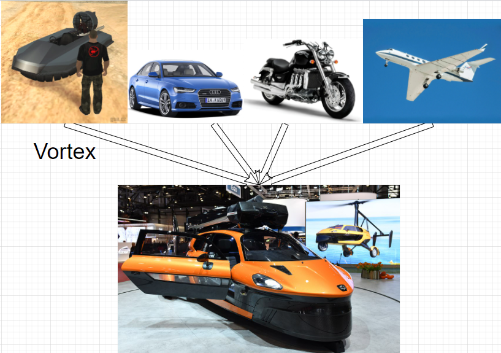

## Bài toán về nguyên lý 4: Chia nhỏ interface – Interface segregation principle (ISP)

## 1. Architecture
### Nút thắt cổ chai
    Vehicle ----> Đ/n một Object máy móc
        driver(), fly(), sail() chèo -> một chiếc máy đa năng
    Boat    ----> Đ/n một đối tượng Thuyển
    Car     ----> Đ/n một đối tượng xe hơi
    Plant   ----> Đ/n một đối tượng máy bay
        Máy bay thì có thể driver + fly
    Nếu tất cả các đối tượng trên implement từ Vehicle -> thì một số method thừa.
### Giải pháp đưa ra.
    Cần đưa ra giải pháp tách nhỏ các Interface để chúng thực hiện các yêu cầu riêng.

## 2. Contents
    Client không nên/không cần triển khai các method mà chúng không sử dụng.

## 3. Phát biểu
    Nếu Interface quá lớn thì nên tách thành các interface nhỏ hơn, 
    với nhiều mục đích cụ thể.

## 4. Ví dụ

    Nếu có thể thì hãy mua 2-3 chiếc vali nhỏ thay vì mua môt chiếc to đùng.
    Vì bạn không thể cưa đôi chiếc vali to ra được đâu.
## 5. Tham khảo
    1. Udemy
    2. SOLID – Nguyên tắc 4: Chia nhỏ interface – Interface segregation principle (ISP)
        https://nhungdongcodevui.com/2017/04/13/solid-la-gi-nguyen-tac-4-chia-nho-interface-interface-segregation-principle-isp/
        
