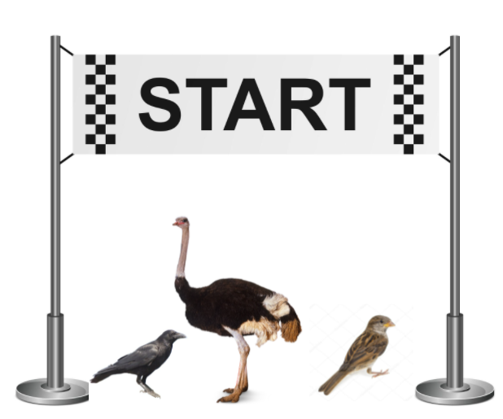

## Bài toàn về nguyên lý 3 - Tính khả dĩ thay thế – Liskov substitution principle (LSP)

## 1. Architecture
    Bird    ---> Loài chim
    Crow    ---> con quạ
    Ostrich ---> đà điểu
    Sparrow ---> chim sẻ

## 2. Contents
    + Nếu có một list các loài chim trong một Game.
    Nếu người chơi chọn chức năng fly -> để thực hiện logic nào đó.
    Nhưng Ostrich -> đâu có thể bay được -> lúc này sẽ có exception.
    
    + Cần phải chia tác chúng ra theo các thức năng để tránh Exception.

## 3. Phát biểu
    Trong một chương trình, các object của class con có thể thay thế class cha 
    mà không làm thay đổi tính đúng đắn của chương trình.
    (Có thể ở đây: là có - hoặc không? -> cần phải phù hợp về mặt business)

## 4. Ví dụ

    
    Cần giải quyết vấn đề trên bằng cách vấn đề trên thì phải chia nhỏ ra các trường hợp
    có thể có trong business:
        Bird(eat, fly) -> Bird(eat, other method) + FlyingBird(fly)...
    
## 5. Tham khảo
    1. Udemy
    2. SOLID – Nguyên tắc 3: Tính khả dĩ thay thế – Liskov substitution principle (LSP)
        https://nhungdongcodevui.com/2017/04/08/solid-la-gi-nguyen-tac-3-tinh-kha-di-thay-the-liskov-substitution-principle-lsp/
        https://toidicodedao.com/2016/05/17/series-solid-cho-thanh-nien-code-cung-liskov-substitution-principle/
        https://www.codeproject.com/Articles/703634/SOLID-architecture-principles-using-simple-Csharp
        http://thaotrinh.info/nguyen-ly-solid-trong-lap-trinh-huong-doi-tuong-va-vi-du-su-dung-c-p2/
        https://scotch.io/bar-talk/s-o-l-i-d-the-first-five-principles-of-object-oriented-design